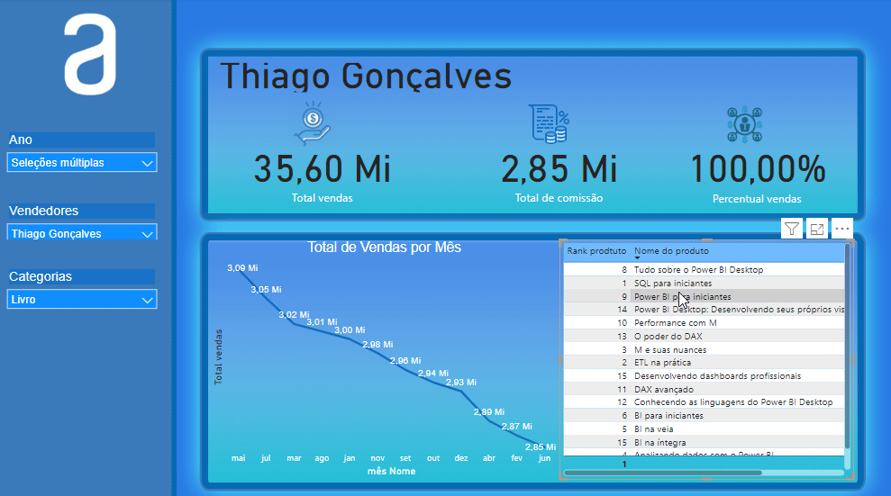

# Projeto Dashboard Venda de Livros

Este projeto foi desenvolvido durante a formação Power BI na Alura, com o objetivo de explorar o tratamento de dados no Power BI Desktop. Utilizando datasets em diferentes formatos, o foco foi criar um dashboard interativo para visualizar as vendas de uma biblioteca, praticando técnicas de ETL e medidas no Power BI.

### :computer: Sobre o Projeto

O projeto consiste na construção de um dashboard de vendas para uma biblioteca, destacando o total de vendas por funcionário, comissões recebidas e a evolução das vendas ao longo de quatro anos (2015 a 2018) para duas categorias de produtos: eBooks e livros físico.

### :pushpin: Funcionalidades do projeto
- Total de vendas por funcionário.
- Ranking dos livros mais vendidos.
- Filtros de categoria, vendedores e ano.
- Taxa de conversão por funcionário.

### :hammer: Softwares utilizadas
- `Power BI`
- `Excel`

### :open_file_folder: Como abrir e rodar o projeto
1.	Faça o download da base de dados e do arquivo `.pbix`.
2.	Abra o Power BI e carregue o arquivo `.pbix` na mesma pasta onde os datasets estão salvos.
3.	O projeto estará pronto para ser visualizado e avaliado.

### :bulb: Contato
Se este projeto te ajudou, não esquece de me seguir! ✨ Fico super feliz em receber sugestões de melhorias ou dicas para continuar evoluindo! Pode me chamar no Linkedin ou mandar um e-mail, vou adorar conversar com você! 😊📩
- Email: rlarissa191@gmail.com
- Linkedin: https://www.linkedin.com/in/larissa-de-almeida-ribeiro-212214197/

